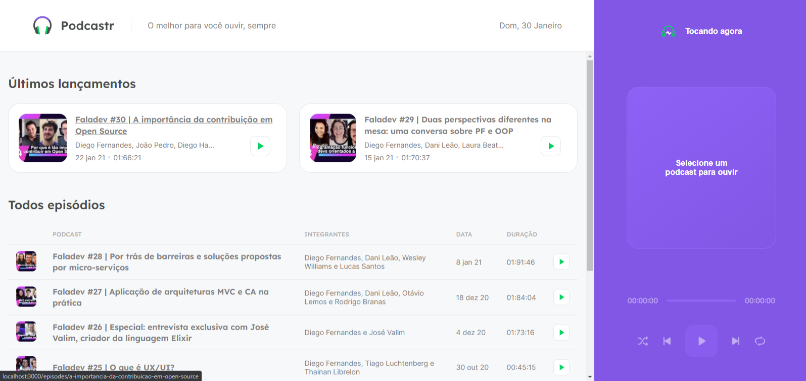
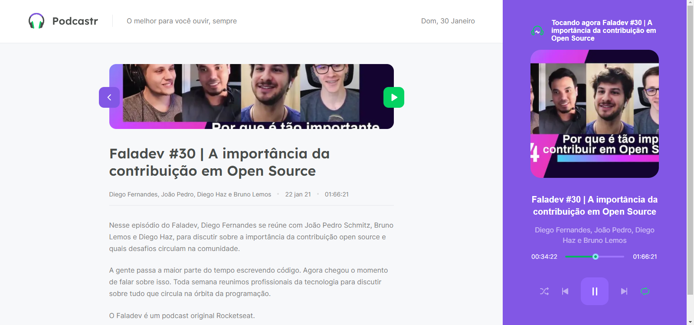

<p align="center">
  
</p>

<p align="center">
  <a href="#-tecnology">Tecnology</a>&nbsp;&nbsp;&nbsp;|&nbsp;&nbsp;&nbsp;
  <a href="#-project">Project</a>&nbsp;&nbsp;&nbsp;|&nbsp;&nbsp;&nbsp;
  <a href="#-license">License</a>
</p>

<p align="center">
 

  
</p>

<br>

## 💻 Project

##### Projeto Front-End Construido durante o NLW 5ª Edição 

<p>Podcastr é app web onde é possível escutar podcast executado através de um player, contendo todas as essencias funcionalidades de um player para uma boa experiencia! esse projeto foi utilizado o Next js
e Sass</P>


# Preview 🛰

<p align="center">
  
</p>
<p align="center">
  
</p>


## 🚀 Technology

This project was developed with the following technologies:


<b>Frontend</b>
- [React]()
- [Next]()
- [Sass]()

## 🛠 Install

1. Clone o repositório:

   ```bash
   $ git clone https://github.com/edsnasc/podcastr.git
   ```
2. execute os comandos 

    ```bash
    $yarn install - instale as dependencias
    $yarn server - execute o servidor json
    $yarn dev - execute o app
   ```

## 📝 License

This project is under the MIT license. See the [LICENSE] file (LICENSE.md) for more details.

---

Created by Edson Nascimento 🚀/ [LinkedIn](https://www.linkedin.com/in/edson-nascimento-5783681aa/)
